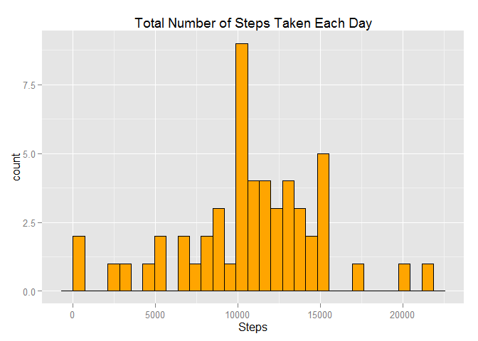
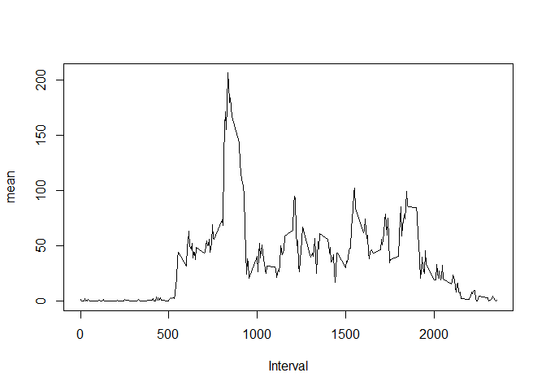
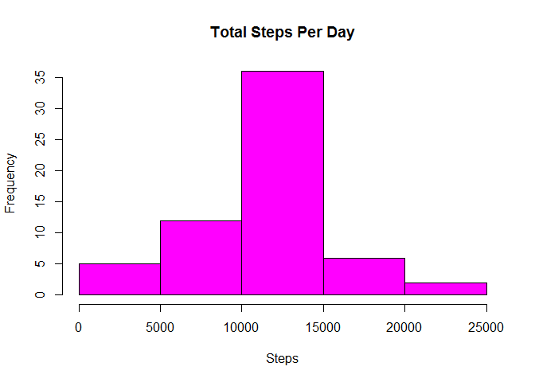
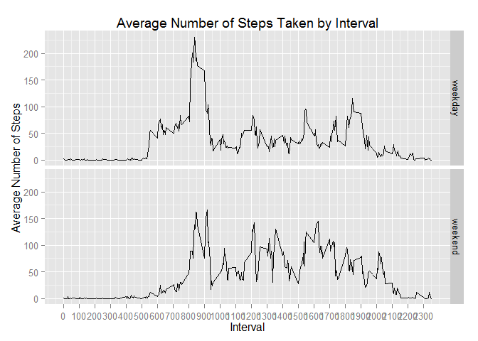

Reproducible Research: Peer Assessment 1
===========================================


## Loading and preprocessing the data

```r
data <- read.csv('activity.csv', header = TRUE)
library(data.table)
library(lubridate)
```

```
## 
## Attaching package: 'lubridate'
## 
## The following objects are masked from 'package:data.table':
## 
##     hour, mday, month, quarter, wday, week, yday, year
```

```r
library(ggplot2)
dt <- as.data.table(data)
```
## What is mean total number of steps taken per day?

```r
#Total number of steps taken per day
steps1 <- dt[, .(Sum.Steps = sum(steps)), by = date]
#> steps1
# date Sum.Steps
# 1: 2012-10-01        NA
# 2: 2012-10-02       126
# 3: 2012-10-03     11352
# 4: 2012-10-04     12116
# 5: 2012-10-05     13294
# 6: 2012-10-06     15420
# 7: 2012-10-07     11015
# 8: 2012-10-08        NA
# 9: 2012-10-09     12811
# 10: 2012-10-10      9900
# 11: 2012-10-11     10304
# 12: 2012-10-12     17382
# 13: 2012-10-13     12426
# 14: 2012-10-14     15098
# 15: 2012-10-15     10139
# 16: 2012-10-16     15084
# 17: 2012-10-17     13452
# 18: 2012-10-18     10056
# 19: 2012-10-19     11829
# 20: 2012-10-20     10395
# 21: 2012-10-21      8821
# 22: 2012-10-22     13460
# 23: 2012-10-23      8918
# 24: 2012-10-24      8355
# 25: 2012-10-25      2492
# 26: 2012-10-26      6778
# 27: 2012-10-27     10119
# 28: 2012-10-28     11458
# 29: 2012-10-29      5018
# 30: 2012-10-30      9819
# 31: 2012-10-31     15414
# 32: 2012-11-01        NA
# 33: 2012-11-02     10600
# 34: 2012-11-03     10571
# 35: 2012-11-04        NA
# 36: 2012-11-05     10439
# 37: 2012-11-06      8334
# 38: 2012-11-07     12883
# 39: 2012-11-08      3219
# 40: 2012-11-09        NA
# 41: 2012-11-10        NA
# 42: 2012-11-11     12608
# 43: 2012-11-12     10765
# 44: 2012-11-13      7336
# 45: 2012-11-14        NA
# 46: 2012-11-15        41
# 47: 2012-11-16      5441
# 48: 2012-11-17     14339
# 49: 2012-11-18     15110
# 50: 2012-11-19      8841
# 51: 2012-11-20      4472
# 52: 2012-11-21     12787
# 53: 2012-11-22     20427
# 54: 2012-11-23     21194
# 55: 2012-11-24     14478
# 56: 2012-11-25     11834
# 57: 2012-11-26     11162
# 58: 2012-11-27     13646
# 59: 2012-11-28     10183
# 60: 2012-11-29      7047
# 61: 2012-11-30        NA

# histogram of the total number of steps taken each day
ggplot(steps1, aes(Sum.Steps)) + geom_histogram(fill = 'orange', colour = 'black') + xlab('Steps') + ggtitle("Total Number of Steps Taken Each Day")
```

```
## stat_bin: binwidth defaulted to range/30. Use 'binwidth = x' to adjust this.
```

 

```r
#Calculate and report the mean and median of the total number of steps taken per day
mean(steps1$Sum.Steps, na.rm = T)
```

```
## [1] 10766
```

```r
median(steps1$Sum.Steps, na.rm = T)
```

```
## [1] 10765
```
## What is the average daily activity pattern?

```r
steps2 <- dt[, .(Mean.Steps = mean(steps, na.rm = TRUE)), by = interval]
# > steps2
# interval Mean.Steps
# 1:        0  1.7169811
# 2:        5  0.3396226
# 3:       10  0.1320755
# 4:       15  0.1509434
# 5:       20  0.0754717
# ---                    
# 284:     2335  4.6981132
# 285:     2340  3.3018868
# 286:     2345  0.6415094
# 287:     2350  0.2264151
# 288:     2355  1.0754717
plot(steps2$interval, steps2$Mean.Steps, type = 'l', xlab = 'Interval', ylab = 'mean')
```

 

```r
#Which 5-minute interval, on average across all the days in the dataset, 
#contains the maximum number of steps?
steps2$interval[which.max(steps2$Mean.Steps)]
```

```
## [1] 835
```
## Imputing missing values

```r
sum(is.na(dt))
```

```
## [1] 2304
```

```r
#Devise a strategy for filling in all of the missing values in the dataset
#& Create a new dataset that is equal to the original dataset but with the missing data filled in.
# I replace the missing value with the average for that interval
dt1 <- merge(dt, steps2, by = 'interval')
dt1$steps[is.na(dt1$steps)] <- dt1$Mean.Steps[is.na(dt1$steps)]
# tidying the data
dt1$Mean.Steps <- NULL
#the new toatl of steps per day
steps3 <- dt1[, .(Sum.Steps = sum(steps)), by = date]
# > steps3
# date Sum.Steps
# 1: 2012-10-01  10766.19
# 2: 2012-10-02    126.00
# 3: 2012-10-03  11352.00
# 4: 2012-10-04  12116.00
# 5: 2012-10-05  13294.00
# 6: 2012-10-06  15420.00
# 7: 2012-10-07  11015.00
# 8: 2012-10-08  10766.19
# 9: 2012-10-09  12811.00
# 10: 2012-10-10   9900.00
# 11: 2012-10-11  10304.00
# 12: 2012-10-12  17382.00
# 13: 2012-10-13  12426.00
# 14: 2012-10-14  15098.00
# 15: 2012-10-15  10139.00
# 16: 2012-10-16  15084.00
# 17: 2012-10-17  13452.00
# 18: 2012-10-18  10056.00
# 19: 2012-10-19  11829.00
# 20: 2012-10-20  10395.00
# 21: 2012-10-21   8821.00
# 22: 2012-10-22  13460.00
# 23: 2012-10-23   8918.00
# 24: 2012-10-24   8355.00
# 25: 2012-10-25   2492.00
# 26: 2012-10-26   6778.00
# 27: 2012-10-27  10119.00
# 28: 2012-10-28  11458.00
# 29: 2012-10-29   5018.00
# 30: 2012-10-30   9819.00
# 31: 2012-10-31  15414.00
# 32: 2012-11-01  10766.19
# 33: 2012-11-02  10600.00
# 34: 2012-11-03  10571.00
# 35: 2012-11-04  10766.19
# 36: 2012-11-05  10439.00
# 37: 2012-11-06   8334.00
# 38: 2012-11-07  12883.00
# 39: 2012-11-08   3219.00
# 40: 2012-11-09  10766.19
# 41: 2012-11-10  10766.19
# 42: 2012-11-11  12608.00
# 43: 2012-11-12  10765.00
# 44: 2012-11-13   7336.00
# 45: 2012-11-14  10766.19
# 46: 2012-11-15     41.00
# 47: 2012-11-16   5441.00
# 48: 2012-11-17  14339.00
# 49: 2012-11-18  15110.00
# 50: 2012-11-19   8841.00
# 51: 2012-11-20   4472.00
# 52: 2012-11-21  12787.00
# 53: 2012-11-22  20427.00
# 54: 2012-11-23  21194.00
# 55: 2012-11-24  14478.00
# 56: 2012-11-25  11834.00
# 57: 2012-11-26  11162.00
# 58: 2012-11-27  13646.00
# 59: 2012-11-28  10183.00
# 60: 2012-11-29   7047.00
# 61: 2012-11-30  10766.19

#Make a histogram of the total number of steps taken each day and Calculate 
#and report the mean and median total number of steps taken per day
hist(steps3$Sum.Steps, xlab = "Steps", main = "Total Steps Per Day", 
     col = "magenta")
```

 

```r
mean(steps3$Sum.Steps)
```

```
## [1] 10766
```

```r
median(steps3$Sum.Steps)
```

```
## [1] 10766
```

```r
#the mean stays unchanged but the median varys a bit. So very light difference overall...
```


## Are there differences in activity patterns between weekdays and weekends?

```r
#Create a new factor variable in the dataset with two levels - "weekday" and "weekend" 
#indicating whether a given date is a weekday or weekend day
day_of_week <- weekdays(as.Date(dt1$date))
dt2 <- cbind(dt1, day_of_week)
# > dt2
# interval     steps       date day_of_week
# 1:        0  1.716981 2012-10-01      Monday
# 2:        0  0.000000 2012-10-02     Tuesday
# 3:        0  0.000000 2012-10-03   Wednesday
# 4:        0 47.000000 2012-10-04    Thursday
# 5:        0  0.000000 2012-10-05      Friday
# ---                                          
# 17564:     2355  0.000000 2012-11-26      Monday
# 17565:     2355  0.000000 2012-11-27     Tuesday
# 17566:     2355  0.000000 2012-11-28   Wednesday
# 17567:     2355  0.000000 2012-11-29    Thursday
# 17568:     2355  1.075472 2012-11-30      Friday

for (i in 1:length(dt2$day_of_week)) {
     if ((dt2[i,]$day_of_week == "Saturday") | (dt2[i,]$day_of_week == "Sunday")) {
          dt2[i,]$day_of_week = "weekend" 
     }
     else {
          dt2[i,]$day_of_week = "weekday"
     }
}


# > dt2
# interval     steps       date day_of_week
# 1:        0  1.716981 2012-10-01     weekday
# 2:        0  0.000000 2012-10-02     weekday
# 3:        0  0.000000 2012-10-03     weekday
# 4:        0 47.000000 2012-10-04     weekday
# 5:        0  0.000000 2012-10-05     weekday
# ---                                          
# 17564:     2355  0.000000 2012-11-26     weekday
# 17565:     2355  0.000000 2012-11-27     weekday
# 17566:     2355  0.000000 2012-11-28     weekday
# 17567:     2355  0.000000 2012-11-29     weekday
# 17568:     2355  1.075472 2012-11-30     weekday

#Make a panel plot containing a time series plot (i.e. type = "l") of the 5-minute 
#interval (x-axis) and the average number of steps taken, averaged across all 
#weekday days or weekend days (y-axis)
steps4 <- dt2[, .(Mean.Steps = mean(steps)), by = .(day_of_week, interval)]
# > steps4
# day_of_week interval Mean.Steps
# 1:     weekday        0 2.25115304
# 2:     weekend        0 0.21462264
# 3:     weekday        5 0.44528302
# 4:     weekend        5 0.04245283
# 5:     weekday       10 0.17316562
# ---                                
# 572:     weekend     2345 1.70518868
# 573:     weekday     2350 0.29685535
# 574:     weekend     2350 0.02830189
# 575:     weekday     2355 1.41006289
# 576:     weekend     2355 0.13443396
ggplot(data = steps4, mapping = aes(x = interval, y = Mean.Steps)) + geom_line() + facet_grid(day_of_week ~ .) + 
     scale_x_continuous("Interval", breaks = seq(min(steps4$interval), max(steps4$interval), 100)) + 
     scale_y_continuous("Average Number of Steps") + ggtitle("Average Number of Steps Taken by Interval")
```

 
